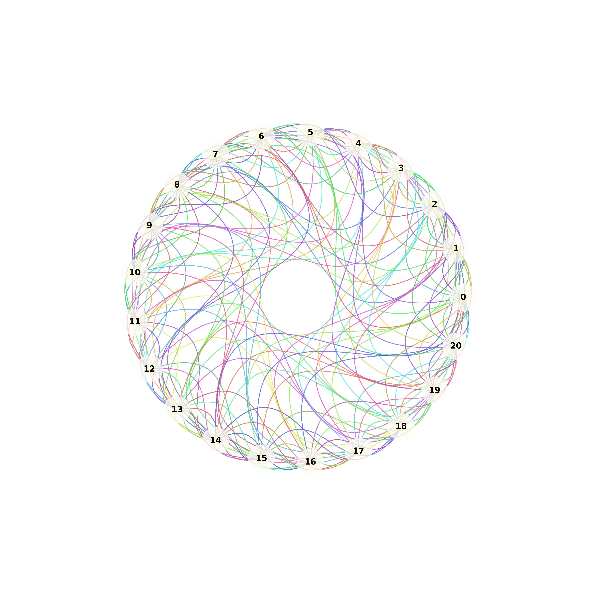

# 嗒宝·宝可梦桌游背后的数学奥秘：有限射影平面

在不久前的研究中，我发现了一个关于嗒宝·宝可梦(Dobble Pokemon)桌游的有趣数学问题。这款桌游的每张卡牌上有8个不同的精灵，而且任意两张卡牌之间恰好有一个相同的精灵。你有没有想过，这样的游戏最多可以有多少张卡牌呢？每个精灵又会出现几次呢？答案是：最多可以有57张卡牌，每个精灵出现8次。

起初，我以为这只是一道简单的排列组合题，还想当然地认为如果每张卡上有n个图案，最多能构造的卡牌数是`n^2 - n + 1`。所以，当每张卡牌上有7个图案时，我以为可以构造43张卡牌，但正确答案却只有8。然而，当每张卡牌上有6、9或10个图案时，这个公式又成立了，可到11个图案时，公式又不成立了。这表明这个问题背后的数学并不简单。

### 相关概念规定
为了更好地理解这个问题，我们先做一些规定：
- 每张卡牌上的符号数记作s。
- 总的用到过的符号数记作n。
- 总的卡牌数记作k。

我们的目标是构造一组卡牌，使得每两张之间恰有一个相同的符号。并且为了让问题更有意义，我们希望这个相同的符号不是重复的，不然就可以让每张卡牌都有某个符号，余下的符号全不同。在这些规定下，我们可以提出三个问题：
1. 给定s，最大的k是多少？
2. 给定n，最大的k是多少？
3. 给定k，至少需要多少s或n？

这里我们重点关注第一个问题。

### 简单构造方法
当给定每个卡牌上的符号数s时，我们可以用下面的步骤构造出s + 1张卡牌：
1. 画一个`(s + 1)×(s + 1)`的表格。
2. 划去对角线，不填任何符号。
3. 在左下半区填上不同的符号。
4. 在右上半区，填上对称的符号。
5. 每一行或列上的字符就是合法的一张卡牌。

例如，用A到F这6个字母来构造，过程如下：
|   | 1 | 2 | 3 | 4 | 5 | 6 |
|---|---|---|---|---|---|---|
| 1 |   | A | B | C | D | E |
| 2 | A |   | D | E | B | F |
| 3 | B | D |   | F | E | C |
| 4 | C | E | F |   | A | D |
| 5 | D | B | E | A |   | F |
| 6 | E | F | C | D | F |   |

如此得到4张卡牌：ABC，ADE，BDE，CEF。可以看出，用这种方法，每张卡牌上的符号数是s时，卡牌数量是s + 1，一共用到`s(s - 1)/2`个符号。

嗒宝·宝可梦的每张卡牌上有8个符号，按这种方法只能构造出9张卡牌，这样的游戏显然没什么意思，但我们有办法做得更好。

### 法诺盘的奇妙之处
我们来看这样一张图，称为“法诺盘（fano plane）”：

.svg)

这张图中有7个点，7条线（包括那个圆），每条线经过3个点，每两条线恰好有一个共用点。如果把每个点视为一个符号，每条线视为一张卡牌，那么就可以根据法诺图构造出7张卡牌，每张卡牌上有三个点。而根据之前的方法只能构造出4张卡牌，所以这种方法效率更高。

### 有限射影平面
法诺盘在数学中是有限射影平面(finite projective plane)的一种，它具有以下数量性质：有`N^2 + N + 1`个点，有`N^2 + N + 1`条线，每条线上有`N + 1`个点，每个点在`N + 1`条线上。这个N被称为射影平面的“阶”。

一般来说，在类似嗒宝·宝可梦的游戏中，如果每张卡牌上有s个符号，则对应s - 1阶的有限射影平面。嗒宝·宝可梦对应的是7阶，把N = 7代入以上公式，马上可以得到：
- 点数（即总的符号数n）：`7^2 + 7 + 1 = 57`
- 线数（即总的卡牌数k）：`7^2 + 7 + 1 = 57`
- 每条线上的点数（即每张卡牌上的符号数s）：`7 + 1 = 8`
- 每个点所在的线数（即每个符号出现的次数）：`7 + 1 = 8`

这就完美地解释了嗒宝·宝可梦桌游中卡牌数量和精灵出现次数的数学原理。有限射影平面的理论为这类问题提供了深入的理解，也展示了数学在生活中的奇妙应用。 

嗒宝·宝可梦最多可以有
张卡牌，用到了57个图案，每个图案出现8次，它可以用下图可视化：

这是一张更漂亮的4-阶的射影平面图

